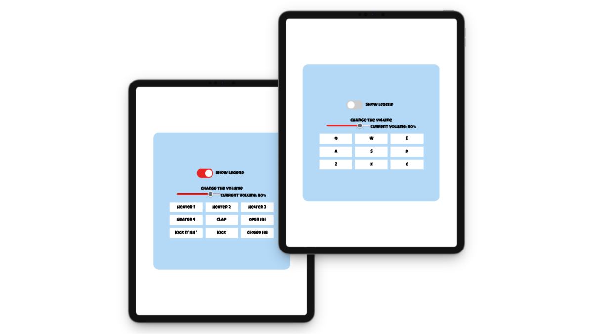

# Drum Machine

A web-based drum machine built with React, Redux, and Vite. This project was created as part of the [freeCodeCamp Front End Development Libraries curriculum](https://www.freecodecamp.org/learn/front-end-development-libraries/front-end-development-libraries-projects/build-a-drum-machine).



## Project Overview

This drum machine allows users to play drum sounds by clicking on pads or pressing corresponding keyboard keys. It features volume control, a legend toggle, and a display showing the current sound.

> **Note:**
> Redux was used in this project primarily for practice and educational purposes. While using React’s built-in state management would be more straightforward for a project of this size, the code is structured as if it were part of a larger-scale application to demonstrate scalable Redux patterns.

## Features

* Play drum sounds via mouse or keyboard
* Volume control slider
* Toggle to show/hide pad legends
* Display of the current track name

## Tech Stack

* React (v19)
* Redux & React-Redux
* Redux Toolkit
* Vite (for fast development and build)
* SCSS (for styling)

## Installation & Usage

**Prerequisites:**
* Node.js 18 or higher
* npm 9 or higher


1. Install dependencies:
```bash
npm install
```

2. Run the development server:
```bash
npm run dev
```

3. Build for production:
```bash
npm run build
```
