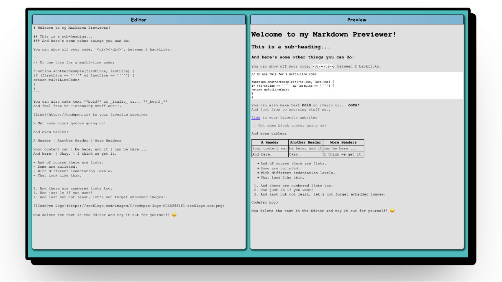

# Markdown Previewer

A real-time markdown editor and previewer built as part of the freeCodeCamp curriculum. Features a dual-pane interface with live preview updates as you type.



## Features

* **Real-time preview** - See your markdown rendered instantly as you type
* **Dual-pane interface** - Side-by-side editor and preview windows
* **Syntax highlighting** - Code block presentation
* **Responsive design** - Works on desktop and mobile devices

## Built With

* HTML5 - Structure and semantics
* SCSS - Styling with variables and modern CSS features
* JavaScript (ES6+) - Core functionality
* jQuery - DOM manipulation
* Marked.js - Markdown parsing
* DOMPurify - XSS protection for rendered HTML
* Vite - Build tool and development server

## Purpose

This project was completed as part of the [freeCodeCamp Front End Development Libraries certification](https://www.freecodecamp.org/learn/front-end-development-libraries/). jQuery was intentionally chosen over vanilla JavaScript or modern frameworks as a way to explore and practice this widely-used library.

## Getting Started

**Prerequisites**

* Node.js (v18 or higher)
* npm (v9 or higher)

**Installation**

1. Install dependencies
```bash
npm install
```

2. Start the development server
```bash
npm run dev
```

3. Open your browser to http://localhost:5173 (default Vite port)

## Acknowledgments

* [freeCodeCamp](https://www.freecodecamp.org/) for the project requirements and learning path
* [Marked.js](https://marked.js.org/) for excellent markdown parsing
* [DOMPurify](https://github.com/cure53/DOMPurify) for security
