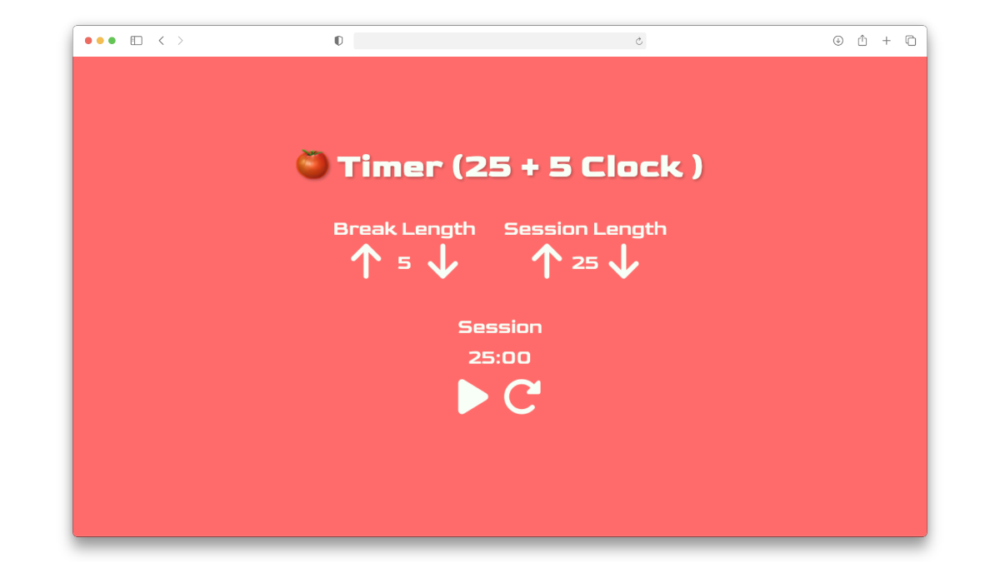

# 🍅 Pomodoro Timer (25 + 5 Clock)

A sleek Pomodoro Timer built with React and SCSS, featuring customizable work/break intervals.



## 📖 About This Project

This Pomodoro Timer was built as part of the freeCodeCamp Frontend Development Libraries certification. It meets all the [project requirements](https://www.freecodecamp.org/learn/front-end-development-libraries/front-end-development-libraries-projects/build-a-25--5-clock) including customizable session/break lengths, audio notifications, and full timer controls.

The Pomodoro Technique is a time management method that uses 25-minute focused work sessions followed by 5-minute breaks to boost productivity and maintain focus.

## ✨ Features

- **Customizable Timers**: Adjust both session (1-60 minutes) and break (1-60 minutes) lengths
- **Audio Notifications**: Sound alerts when sessions complete
- **Responsive Design**: Works seamlessly on desktop, tablet, and mobile devices
- **Clean Interface**: Modern design with intuitive controls

## 📱 How to Use

1. **Set Your Timers**: Use the arrow buttons to adjust session and break lengths
2. **Start/Pause**: Click the play/pause button to control the timer
3. **Reset**: Click the reset button to return to default settings
4. **Audio Alerts**: Listen for the beep when each session completes
5. **Automatic Switching**: Timer automatically alternates between work and break sessions

## 🛠️ Built With

- **React** - Component-based UI library
- **SCSS** - Enhanced CSS with variables and nesting
- **Vite** - Fast build tool and development server
- **Font Awesome** - Icon library for UI elements
- **Google Fonts** - Custom typography (Goldman & Orbitron)

## 🚀 Getting Started

### Prerequisites
- Node.js (v14 or higher)
- npm or yarn

### Installation
```bash
npm install
npm run dev
```
