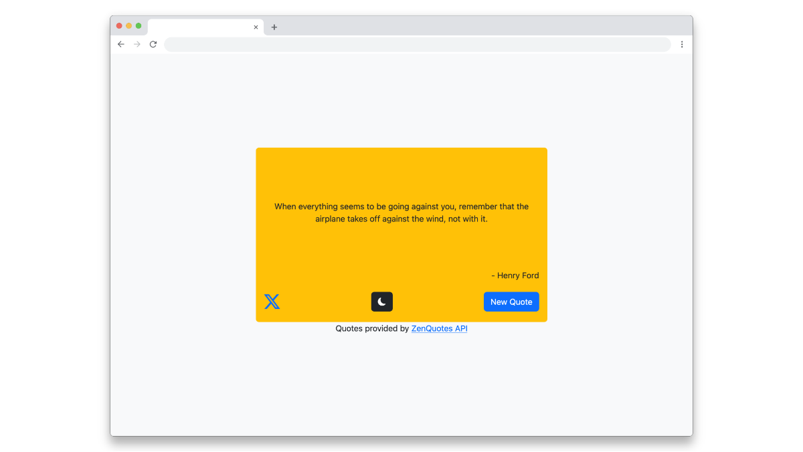

# Random Quote Machine

A responsive web application that displays inspirational quotes with theme switching capabilities, built as part of the freeCodeCamp curriculum.

## Description

The Random Quote Machine is a React-based web application that fetches and displays random inspirational quotes. Users can cycle through quotes and toggle between a light and a dark theme. This project was developed as part of the freeCodeCamp Front End Development Libraries certification, focusing on React class components and Bootstrap styling.



## Tech Stack

**Built With:**
- React
- Vite
- Bootstrap
- Bootstrap Icons

**Requirements:**
- Node.js v18 or higher
- npm v8 or higher

## Installation / Setup
```bash
Install dependencies:
npm install

Start the development server:
npm run dev
```

## API

This project uses the [ZenQuotes API](https://zenquotes.io/) to fetch the quotes. The API provides:
* Random quotes with authors
* Does not require authentification
* Has rate limit (FREE version only), which is why you might not be able to always get a new quote

It also uses [CORS Anywhere](https://github.com/Rob--W/cors-anywhere/) via the provided [Live Example](https://cors-anywhere.herokuapp.com/) to avoid issues with cross-origin requests. Make sure to request a temporary access to the live demo server when running locally. Keep also in mind that the CORS Anywhere Live Demo should only be used for development purposes.

## Development Approach

This project was intentionally built using **only Bootstrap** for styling (no custom CSS) as a personal challenge.
