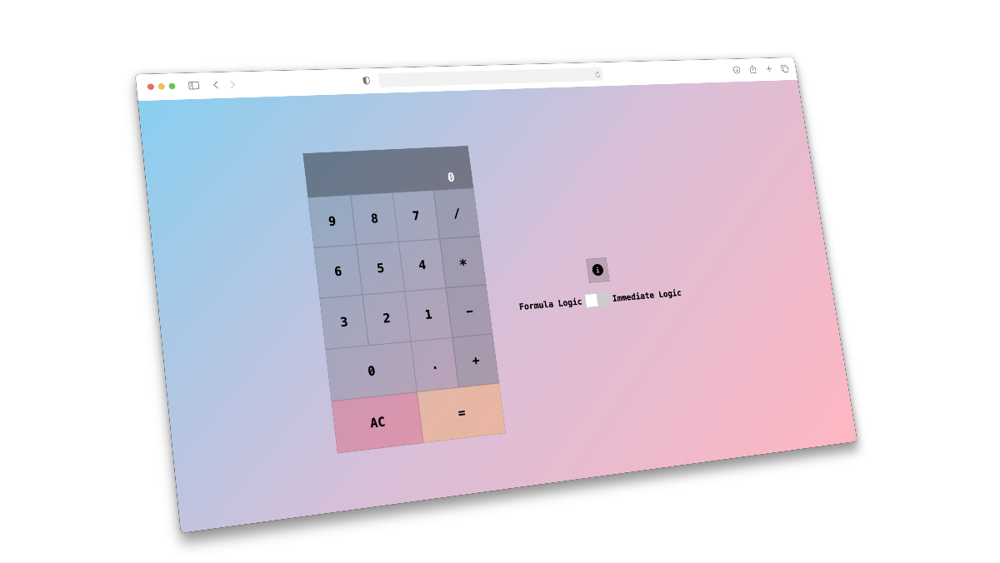

# React Calculator

A JS calculator app built with React as part of the freeCodeCamp curriculum.

## Screenshot


## Key Features

- **No External Library for Calculations**. Pure JavaScript Logic
- **Dual Calculation Logic**
    - **Formula Logic:** Evaluates the entire mathematical expression at once (e.g., 3 + 5 × 6 - 2 ÷ 4 = 32.5)
    - **Immediate Logic:** Performs calculations step-by-step as operators are entered (e.g., 3 + 5 × 6 - 2 ÷ 4 = 11.5)
- **Keyboard support**
    - Input numbers, Enter for equals, Backspace to delete etc.

## Built with
- **React** (Class Components)
- **CSS3**
- **Vite**

## Installation & Setup
```bash
npm install

# Start development server
npm run dev

# Build for production
npm run build
```

## Original Project Vision
The goal was to create a calculator that does not rely on an external library for the calculation. Also since most calculators either do an immediate or formula calculation only, I decided to add support for both in the calculator. Using a switch the user can decide what kind of calculation logic they want to use.
