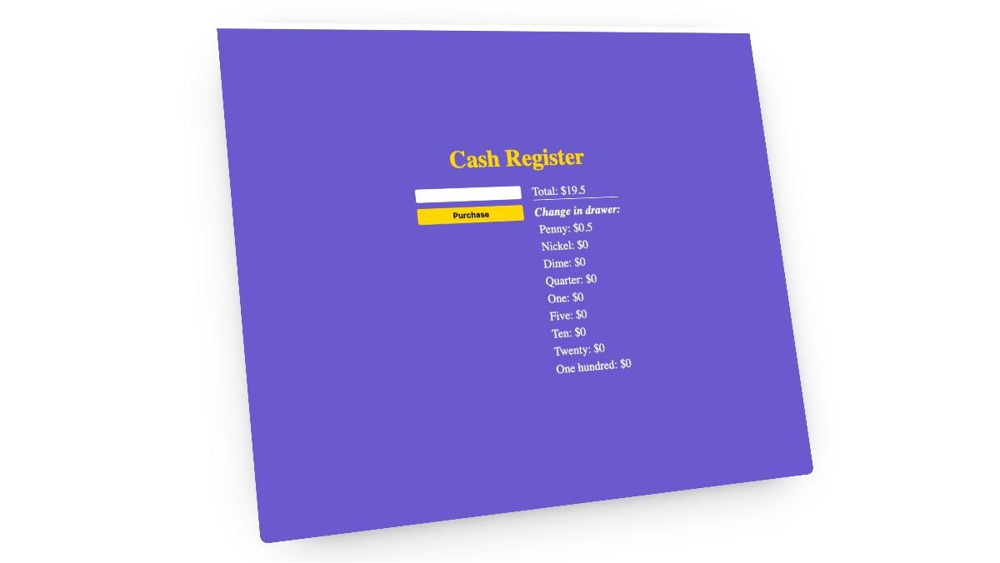

# Cash Register

A simple cash register app built as part of the freeCodeCamp curriculum.

## About

This project is a web-based cash register simulation. Users can enter the amount of cash given by a customer, and the app will calculate and display the change due, as well as update the cash-in-drawer. The interface is styled for clarity and ease of use.

## How to Use

1. Enter the amount of cash the customer provides in the input box.
1. Click the "Purchase" button.

The app will:

* Show if the customer paid the exact amount, needs change, or if there are insufficient funds.

* Display the change breakdown by denomination.

* Update the cash in drawer display.

## Tech Stack

* HTML
* CSS
* JavaScript (Vanilla)

## Project Requirements

This project was built to meet the requirements of the [freeCodeCamp Cash Register Project](https://www.freecodecamp.org/learn/javascript-algorithms-and-data-structures-v8/build-a-cash-register-project/build-a-cash-register).