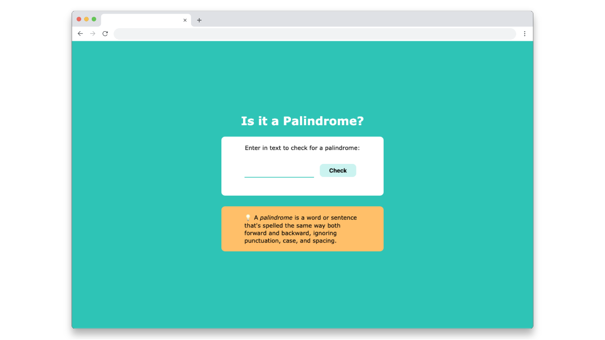

# Palindrome Checker

This is a simple web app that checks whether a given word or sentence is a palindrome.  
A palindrome is a word or sentence that's spelled the same way both forward and backward, ignoring punctuation, case, and spacing.

## How it works

- Enter any text into the input field.
- Click the "Check" button.
- The app will tell you if the input is a palindrome.
