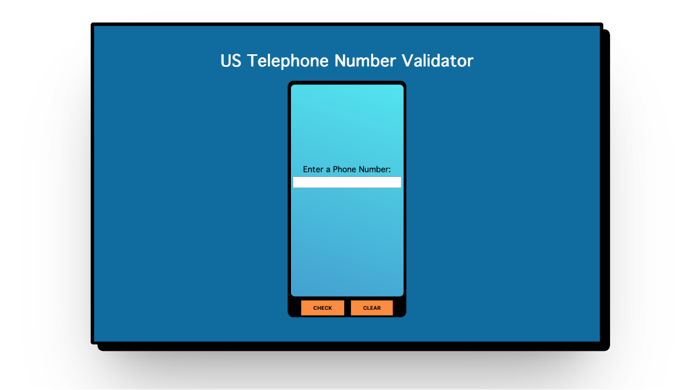

# US Telephone Number Validator

This is a simple web app built as part of the freeCodeCamp curriculum. It allows users to check if a given input is a valid US telephone number.

## How to Use

1. Type a phone number into the input field.
    * *Supports common US phone number formats (with or without country code, dashes, spaces, or parentheses).*
1. Click the "CHECK" button.
1. See the validation result below the input.
1. Click "CLEAR" to start over.

## Tech Stack

* HTML, CSS, JavaScript (Vanilla)
* No external dependencies
